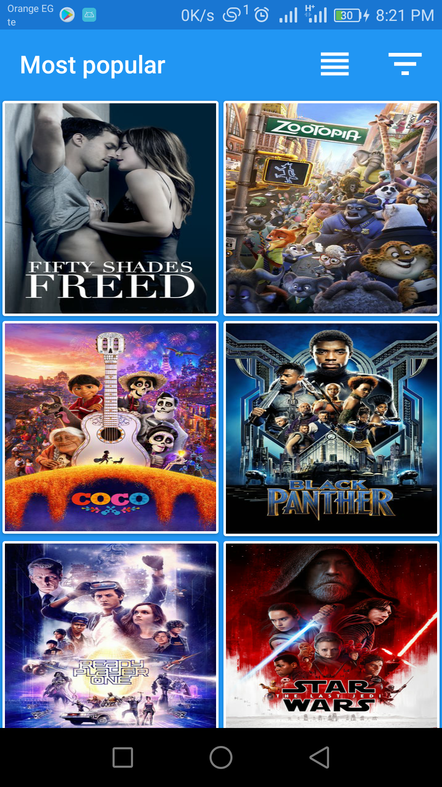
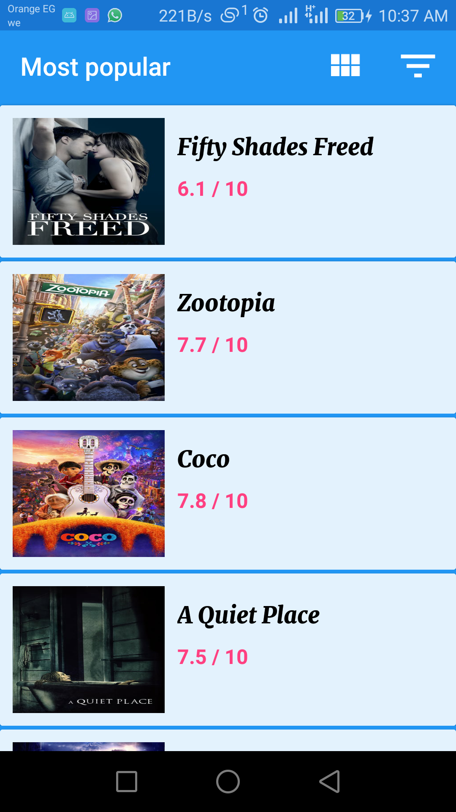
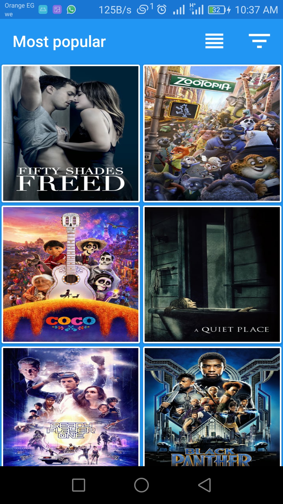
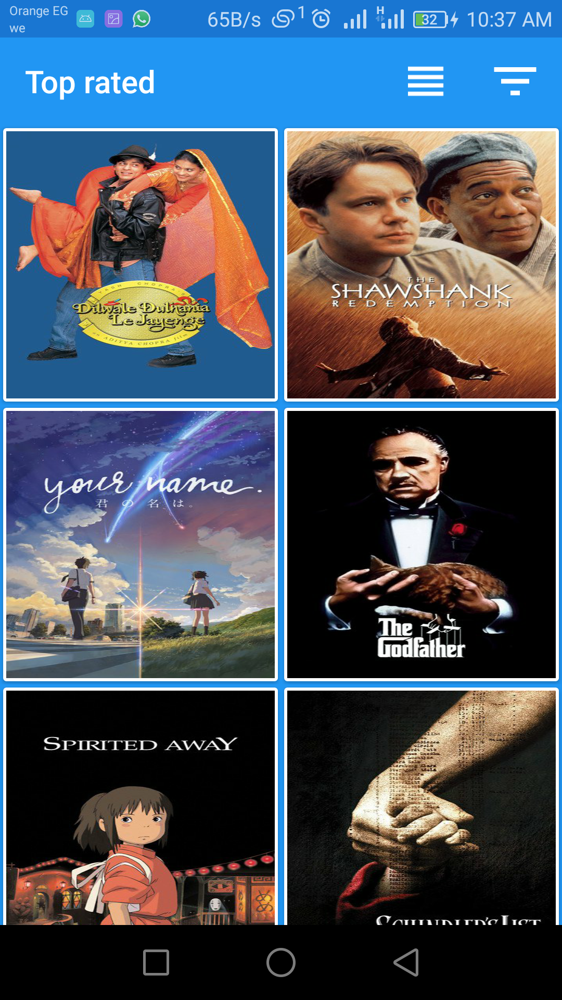
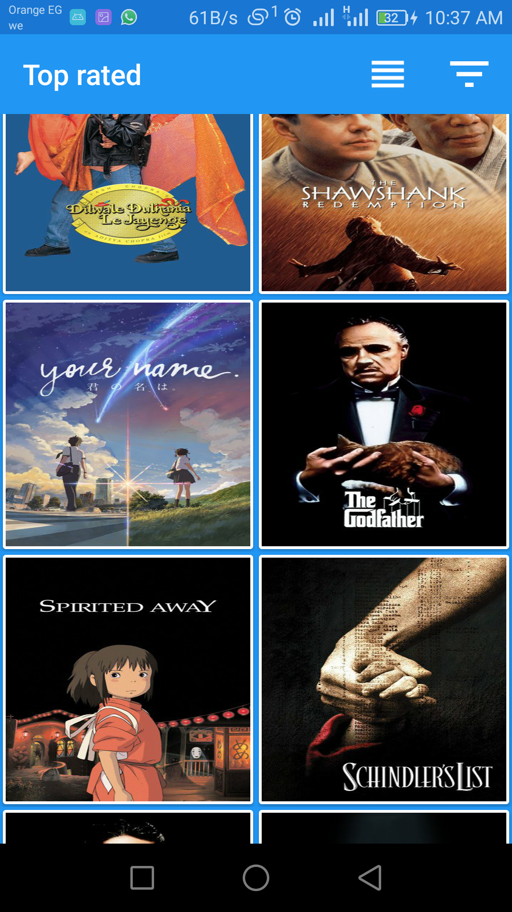
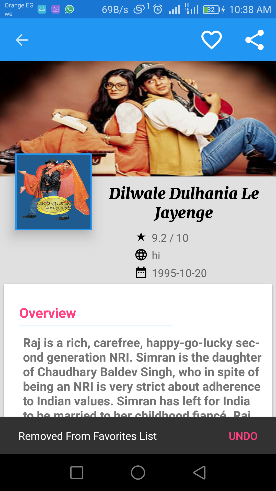

# The MovieDB
- an android application that allows users to browse the popular or top rated movies and can easily save the movie to his favorites list

- you can use it by replace " USE UR KEY " by your new API KEY in strings.xml file 
    
- create your api key from here  (https://api.themoviedb.org).

## Screenshots

  
   

